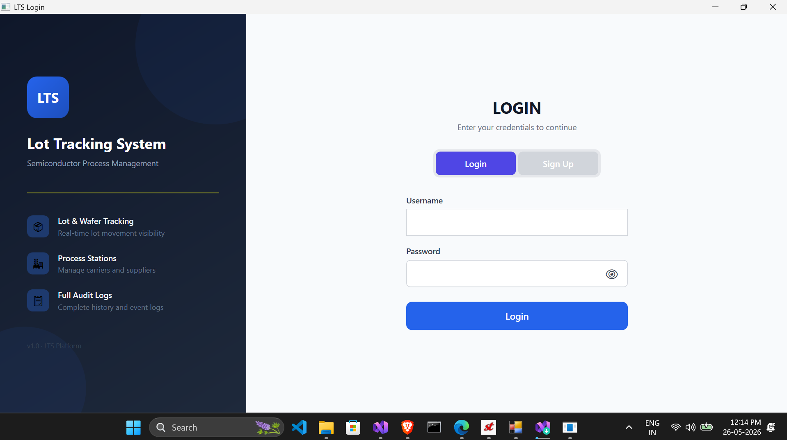
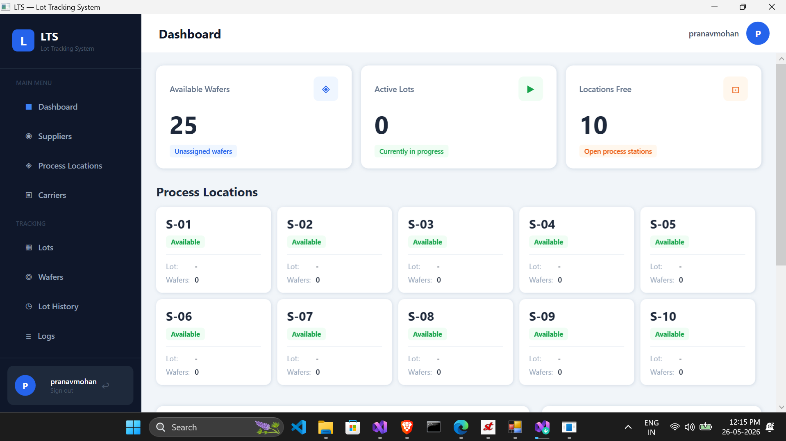
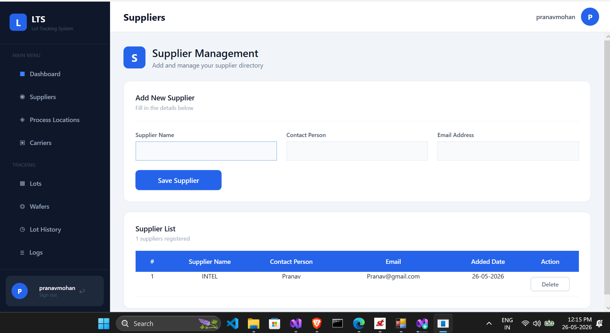
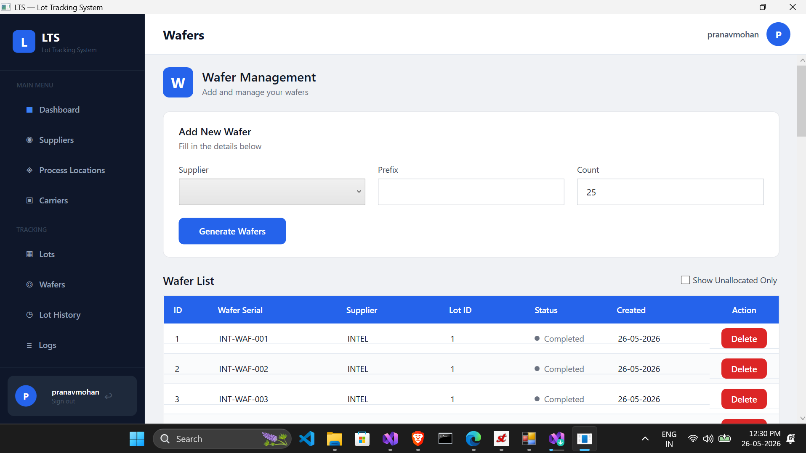
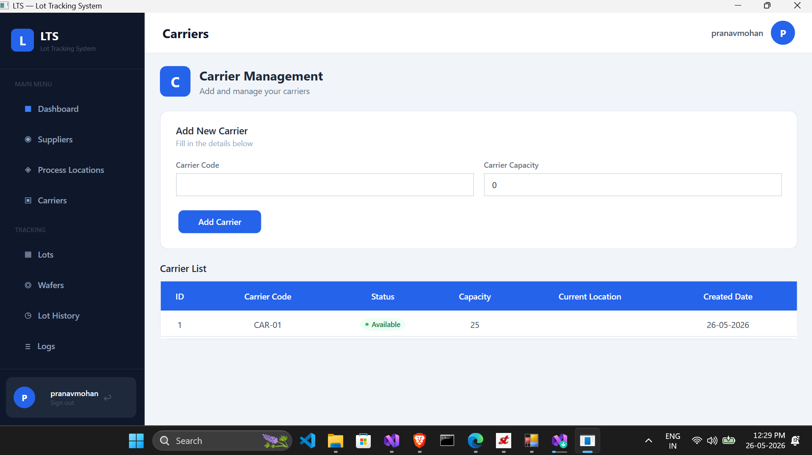
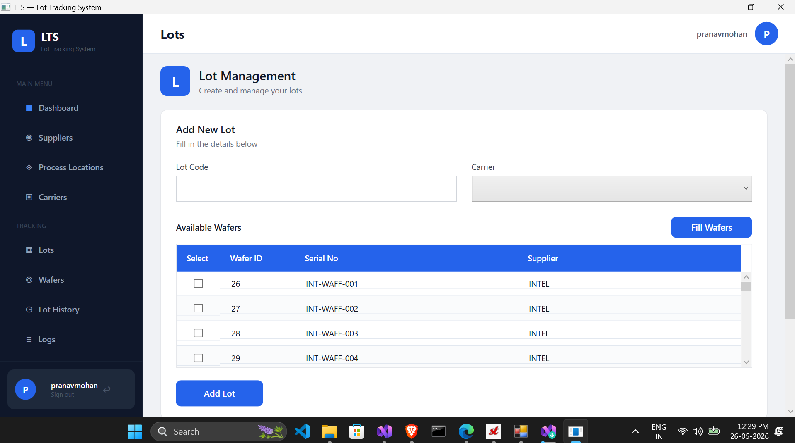
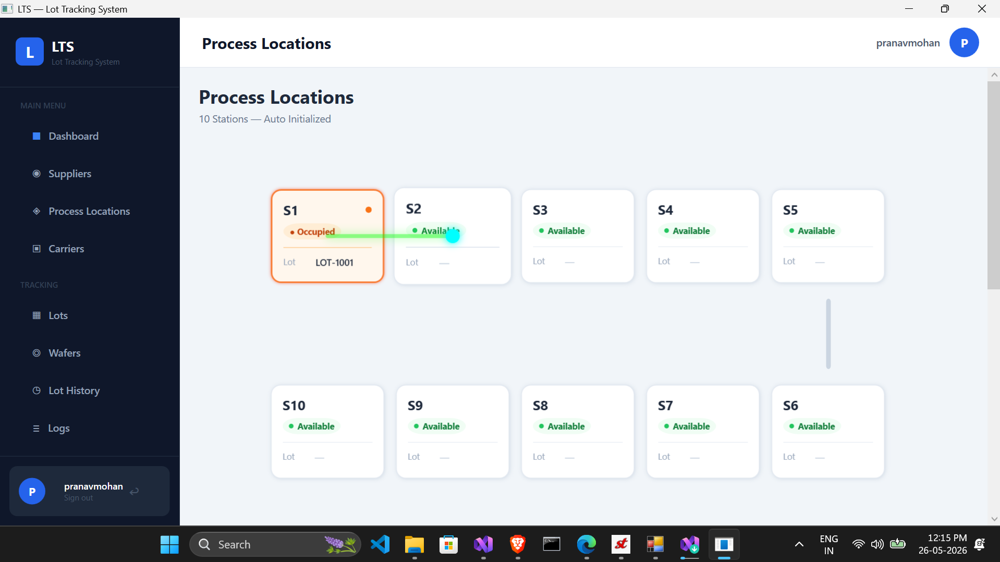
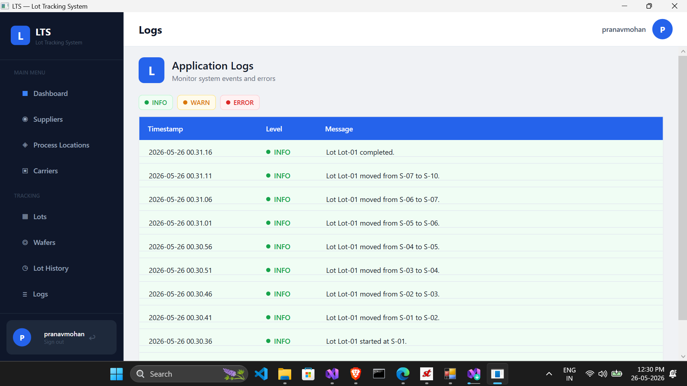

# LTS - Lot Tracking System

A semiconductor-inspired Lot Tracking System built using C#, WPF, MVVM, and SQLite.

The application simulates wafer manufacturing workflow including supplier management, wafer generation, lot creation, process routing, and lot movement through process locations.

---

# Features

## Login System
- User login validation
- Error handling for invalid login

---

## Supplier Management
- Add suppliers
- View suppliers
- Delete suppliers
- Duplicate prevention

---

## Wafer Management
- Bulk wafer generation
- Prefix-based serial generation
- Supplier-based wafer creation
- Duplicate wafer prevention
- Wafer allocation tracking

### Example

Supplier:
INTEL

Prefix:
INT-WAF

Generated:
INT-WAF-001
INT-WAF-002
INT-WAF-003

---

## Carrier Management
- Add carriers
- Define carrier capacity
- Track carrier availability

---

## Lot Management
- Create lots
- Assign carriers
- Select wafers manually
- Auto-fill wafers based on carrier capacity
- Prevent over-allocation

---

## Process Location Simulation
- Initialize process stations
- Route selection
- Lot movement simulation
- Status tracking
- Station occupancy tracking

---

## Process Animation
- Carrier movement between stations
- Route visualization
- Station highlighting
- Process flow simulation

---

# Tech Stack

| Layer | Technology |
|------|------|
| Language | C# |
| UI Framework | WPF |
| Architecture | MVVM |
| Database | SQLite |
| Pattern | Repository Pattern |

---

# Database

Database:
```text
lts.db
```

Tables:
- Users
- Suppliers
- Wafers
- Lots
- ProcessLocations
- Logs
- LotHistory

---

# Setup Instructions

## Requirements

- Windows OS
- Visual Studio 2022
- .NET SDK
- SQLite

---

## Clone Repository

```bash
https://github.com/pranavmohan-eternix/LotTrackingSystem.git
```

---

## Open Solution

Open:

```text
LTS.sln
```

in Visual Studio.

---

## Run Application

Set:

```text
LTS.UI
```

as Startup Project.

Run using:

```text
F5
```

---

# Run Tests

Open terminal in solution folder and run:

```bash
dotnet test
```

---

# Screenshots

## Login Page



---

## Dashboard



---

## Supplier Management



---

## Wafer Management



---

## Carrier Management



---

## Lot Management



---

## Process Locations



---

## Logs



---

---

# Learning Objectives

This project was developed as a semiconductor manufacturing workflow training simulator for learning:

- WPF and MVVM
- Repository Pattern
- SQLite integration
- Process simulation
- Manufacturing workflow concepts
- Layered application architecture

---

